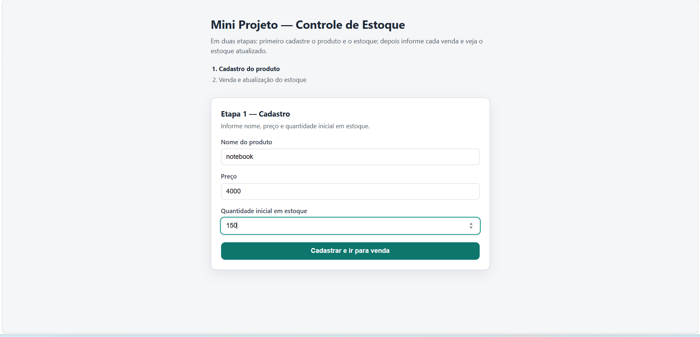
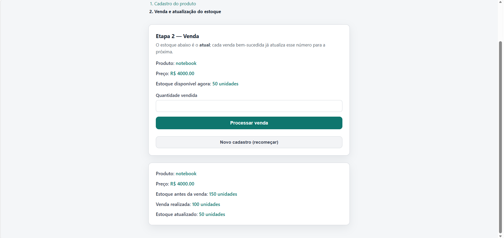

# Mini Projeto — Controle de Estoque

Aplicação em **React** + **TypeScript** (Vite) em **duas etapas**: primeiro cadastra o produto (nome, preço, estoque inicial); depois registra vendas, mostrando o estoque **antes e depois** de cada venda e atualizando o estoque para a próxima, conforme o enunciado.

## Como rodar

1. Instale as dependências:

```bash
npm install
```

2. Inicie o servidor de desenvolvimento:

```bash
npm run dev
```

3. Abra o endereço exibido no terminal (em geral `http://localhost:5173`).

Para gerar a versão de produção:

```bash
npm run build
```

## Capturas de tela (entrega)

O projeto em execução (`npm run dev`):





As imagens estão em [`src/assets/`](src/assets/).

## Regras implementadas

- Campos: nome do produto, preço, quantidade inicial em estoque e quantidade vendida.
- Se a **quantidade vendida for maior** que a **quantidade inicial**, é exibida **exatamente** a mensagem: `Estoque insuficiente para realizar a venda.` e o estoque **não** é reduzido no resumo.
- Caso contrário, o programa mostra o resumo com: Produto, Preço (`R$` com duas casas decimais no formato do exemplo), estoque antes da venda, venda realizada e estoque atualizado.

## Repositório Git e professor

- Publique o código em um repositório Git (GitHub, GitLab, etc.).
- Se o repositório for **privado**, adicione o e-mail do professor como colaborador: **prof2132@iesp.edu.br** (conforme orientação do formulário).

## Estrutura útil do código

- [`src/types.ts`](src/types.ts) — tipos dos dados e do resumo.
- [`src/utils/venda.ts`](src/utils/venda.ts) — função pura `processarVenda` com a regra de negócio e a mensagem oficial de estoque insuficiente.
- [`src/App.tsx`](src/App.tsx) — formulário, envio e exibição do resultado.
- [`src/App.css`](src/App.css) — layout e cores (rótulos escuros, valores em verde/teal).
